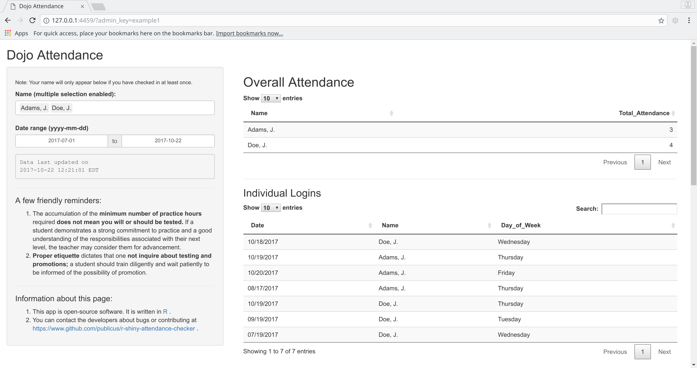
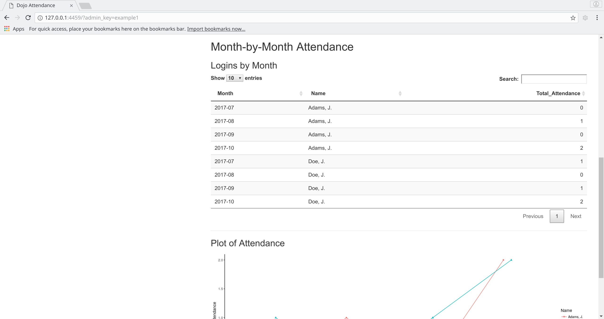

# An Attendance Checker written for [Shiny](http://shiny.rstudio.com/ "Shiny GitHub Page")

## What this app does

This app loads data from either a Google Sheets spreadsheet or CSV file and provides a dashboard for understanding attendance trends. It was built for a martial arts dojo whose students wanted a way to check their number of days trained (for example, when preparing for exams).

By default, it allows the user to look up one name at a time. An "administrator mode" enables comparing multiple users.






## Current maintainer

This repository is maintained by Jacob Levernier (<j@adunumdatum.org>).

## Pros and cons of using this app

### Pros

- This app is free and open-source software
- It is easy to deploy through [ShinyApps.io](https://www.shinyapps.io "ShinyApps.io") (see below)
- It can be used with a Google Form for sign-in and a Google Sheet for data storage. Therefore, it can be used without the need for a server administrator or database manager.

### Cons

- If the data are stored in Google Sheets, the individuals represented in the dataset need to be comfortable with Google storing their data.
- I'm not sure yet how secure Shiny is as a platform.
    - Therefore, I would not yet recommend using this for data that are so sensitive it would be a problem if they leaked (for example, if a user were able to read the location of the full dataset).
    - I also am not sure how secure the configuration setting's `valid_administrator_keys` setting is. Thus, consider the "admin mode" (which allows looking up multiple users at once) a weak lock on the dataset.
- Users are able to look each other up.  
  This can be a pro or con, depending on your organization's needs and the nature of the data. For the app's original use-case, that of a martial arts dojo, existing systems (including paper calendars) already allowed students to check each other's progress; thus, allowing this in this digital system was seen as fine.

## Using this Shiny app

### What the data should look like

The dataset is expected to be a single spreadsheet comprising two columns, named as follows:

- `Timestamp`: A column of timestamps, in `MM/DD/YYYY HH:MM:SS` format (for example, `10/18/2017 13:06:22`)
- `Name`: The name of the individual (for example, `Doe, Jane`, or `Jane Doe`)

Each row is expected to be a check-in from an individual. Thus, three rows of a dataset might look like this:

|      Timestamp      |    Name    |
|---------------------|------------|
| 10/18/2017 13:06:22 | Jane Doe   |
| 10/18/2017 13:22:05 | John Adams |
| 10/19/2017 15:00:43 | Jane Doe   |

### Trying out and developing on this app locally

You will need to install [R](https://r-project.org "R Project") to develop on this app.

In addition, you will need to install the following packages in R:

```{r}
install.packages(c(
	'DT',
	'ggplot2',
	'googlesheets',
	'lubridate',
	'shiny',
	'shinyjs',
	'stringi'
))
```

To try out and develop on this app, I recommend using [RStudio](https://rstudio.com/ "RStudio"), which is free and streamlines the process.

With RStudio installed, perform the following steps:

1. Copy `configuration_settings_TEMPLATE.R` to `configuration_settings.R` in this directory.
2. Open `configuration_settings.R` and edit the settings
3. In RStudio, open `ui.R` or `server.R`.
4. In RStudio, click the "Run App" button.

### Deploying this Shiny app

The easiest way to deploy this app is using a free account at [ShinyApps.io](https://www.shinyapps.io/ "ShinyApps.io").

To do so, you can use the following in R:

```{r}
# install.packages('rsconnect')

# Confirm that your Working Directory is the location of this app:
getwd()

# If it's not, set the working directory with
setwd('/path/to/this/directory')
# or by opening [RStudio](https://rstudio.com/ "RStudio") and clicking "Session" -> "Set Working Directory" -> "Choose Directory..."

# Deploy the app on shinyapps.io:
rsconnect::deployApp('.')  # Deploy the app that is in the current directory ('.')
```

The output from the above command will include an "AppID" from shinyapps.io. You can also look this up in the [shinyapps.io admin page](https://www.shinyapps.io/admin/ "ShinyApps.io Admin page").

If you make changes to your app and want to publish those changes to ShinyApps.io, you can use the following command:

```
rsconnect::deployApp('.', appId = AppIDNumberGoesHere)
```

### Considerations for using ShinyApps.io

Note that ShinyApps.io's [free tier includes 25 "active hours" per month](http://www.shinyapps.io/ "ShinyApps main page, including pricing information") for an app. An ["active hour"](https://support.rstudio.com/hc/en-us/articles/217717407-What-is-an-Active-Hour-for-shinyapps-io- "Shiny 'Active Hours' definition") is an hour during which the app is running and ready to be used, vs. in "standby" mode -- in the latter case, the app will be activated when a user visits the page, which means slightly longer page-load times.

The default time to return an app to standby mode on ShinyApps.io is 15 minutes. You can change this setting in the [shinyapps.io admin page](https://www.shinyapps.io/admin/ "ShinyApps.io Admin page").

## Conditions of use

Please see the `LICENSE.txt` file for license information (i.e., the conditions under which you may reuse this app). The app is released under a ["BSD 3-Clause License"](https://tldrlegal.com/license/bsd-3-clause-license-(revised) "TLDR Legal: 'BSD 3-Clause License (Revised)'"). In summary, this means we have released this app for others to use freely. We would appreciate you making changes you make to the code available back to the community (preferably through this repository).

If you would like to arrange a different license, please contact Jacob Levernier at <j@adunumdatum.org>.

## Contributing to this app

We welcome contributions!

**We also welcome contributions concerning documentation** -- if there are things that you had to work to understand (for example, how to even download these files in the first place), we welcome additional text for a Wiki that we can attach to this repository.

If you would like to contribute to this repository, please follow these steps:

1. If you feel comfortable using Git:
    1. Make a fork of this repository (from this repository's page on GitHub, click "Fork").
    1. Create a single commit that contains all of the changes that you would like to share (either by "squashing" your commits (see [here](http://stackoverflow.com/a/5189600 'StackOverflow: Squash my last X commits together using Git'), for example), or by just copying your altered files into a fresh copy of this repository).
    1. Make a pull request through GitHub (from your copy of the repository in GitHub, click "New Pull Request").
1. If you do not feel comfortable using Git: Send an email to the current repository maintainer listed [above](#current-maintainer 'Current maintainer'); we will work together to get your changes incorporated, and will add you to a list of contributors in this Readme.
